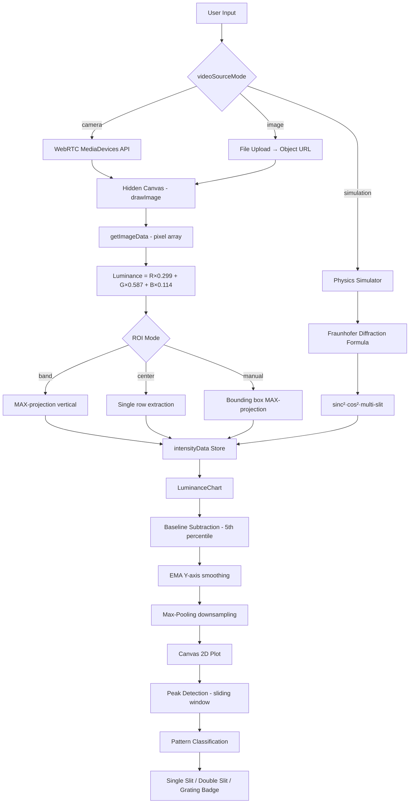

# Laporan Teknis: LightScope — Analisis Fisika & Intensitas Cahaya

> **Dibuat:** 5 Juli 2026  
> **Proyek:** [Light_Intensity_Analyzer](file:///c:/Users/Yusuf/Documents/Github/Light_Intensity_Analyzer)  
> **Versi:** 0.0.0  

---

## 1. Ringkasan Eksekutif

**LightScope** adalah aplikasi web *single-page* (SPA) berbasis browser yang mampu:
1. Menganalisis intensitas cahaya dari **kamera live**, **gambar statis**, atau **simulator fisika**.
2. Memvisualisasikan profil luminansi 1D secara real-time menggunakan Canvas API.
3. Mensimulasikan pola difraksi gelombang cahaya berdasarkan persamaan fisika Fraunhofer.
4. Mendeteksi dan mengklasifikasikan pola difraksi secara otomatis (*Single Slit*, *Double Slit*, *Diffraction Grating*).

---

## 2. Stack Teknologi

| Layer | Teknologi | Versi | Peran |
|---|---|---|---|
| **Framework UI** | Svelte | ^5.55.1 | Reactive component framework |
| **Build Tool** | Vite | ^8.0.4 | Dev server & bundler |
| **Plugin** | @sveltejs/vite-plugin-svelte | ^7.0.0 | Integrasi Svelte dengan Vite |
| **Runtime** | Browser Native APIs | — | Canvas 2D, WebRTC MediaDevices |
| **Bahasa** | JavaScript (ES Modules) | type: module | Logic & komputasi |
| **Styling** | Vanilla CSS + CSS Variables | — | Design system & layout |

> [!NOTE]
> Proyek ini **tanpa dependency runtime eksternal** — semua komputasi fisika dilakukan murni dalam JavaScript browser, tanpa library matematika atau sinyal pihak ketiga.

---

## 3. Arsitektur Aplikasi

### 3.1 Struktur Komponen

```
App.svelte  (Root — layout & routing visual)
├── CameraView.svelte      → Akuisisi & Ekstraksi Data
├── Simulator.svelte       → Simulasi Fisika
├── LuminanceChart.svelte  → Visualisasi & Analisis
└── ControlPanel.svelte    → Input Parameter
```

### 3.2 State Management (Reactive Store)

File: [store.js](file:///c:/Users/Yusuf/Documents/Github/Light_Intensity_Analyzer/src/lib/store.js)

```
Svelte Writable Stores (global reactive state):

isAnalyzing        → Toggle analisis ON/OFF
videoSourceMode    → 'camera' | 'image' | 'simulation'
roiMode            → 'band' | 'center' | 'manual'
intensityData      → Float[] — output data luminansi per kolom piksel
bandHeightPercent  → Tinggi band ROI (%)
simWavelength      → Panjang gelombang (nm)
simSlitWidth       → Lebar celah a (mm)
simSlitDistance    → Jarak antar celah d (mm)
simSlitCount       → Jumlah celah N
simScreenDistance  → Jarak layar L (mm)
```

Seluruh komponen berkomunikasi melalui **reactive stores** — tidak ada prop drilling. Perubahan nilai di `ControlPanel` langsung memperbarui `Simulator` dan `LuminanceChart` secara otomatis.

### 3.3 Alur Data Utama

```
[Sumber Input]
  Camera / Image / Simulator
       ↓
[CameraView / Simulator]
  Ekstraksi piksel → intensityData[]
       ↓
[LuminanceChart]
  Plotting + Peak Detection + Klasifikasi
```

---

## 4. Pipeline Analisis Cahaya (CameraView.svelte)

File: [CameraView.svelte](file:///c:/Users/Yusuf/Documents/Github/Light_Intensity_Analyzer/src/lib/components/CameraView.svelte)

### 4.1 Akuisisi Frame

```javascript
// WebRTC MediaDevices API
stream = await navigator.mediaDevices.getUserMedia({
  video: { deviceId: { exact: $selectedDeviceId }, width: { ideal: 640 }, height: { ideal: 480 } }
});
```

Frame video/gambar di-render ke **hidden Canvas** (off-screen) menggunakan `drawImage()` per animasi frame (`requestAnimationFrame`).

### 4.2 Teori: Perhitungan Luminansi (ITU-R BT.601)

Konversi piksel RGB → luminansi menggunakan formula standar internasional **ITU-R BT.601** (digunakan dalam broadcasting televisi SD):

$$L = \frac{R \times 299 + G \times 587 + B \times 114}{1000}$$

**Implementasi dalam kode:**
```javascript
// Line 339 — CameraView.svelte
let luminance = (data[i]*299 + data[i+1]*587 + data[i+2]*114) / 1000;
```

**Dasar teori:**  
Koefisien ini didasarkan pada sensitivitas relatif mata manusia terhadap setiap warna primer:
- Merah (R): 0.299 — mata cukup sensitif
- Hijau (G): **0.587** — mata paling sensitif terhadap hijau
- Biru (B): 0.114 — mata paling tidak sensitif terhadap biru

> [!IMPORTANT]
> Formula ini berbeda dari BT.709 (HD) yang menggunakan koefisien 0.2126R + 0.7152G + 0.0722B. Pilihan BT.601 relevan untuk kamera web standar yang outputnya belum tentu color-managed dengan profil HD.

### 4.3 Region of Interest (ROI) — 3 Mode

| Mode | Metode | Ekstrasi |
|---|---|---|
| **Band** | Horizontal slice di tengah gambar, tinggi `bandHeightPercent%` | MAX-projection seluruh baris dalam band |
| **Center Line** | Satu baris piksel di tengah (`extractH = 1`) | Luminansi langsung satu baris |
| **Manual Box** | Bounding box bebas drag-and-drop | MAX-projection dalam kotak |

### 4.4 MAX-Projection (Scientific Peak Preservation)

```javascript
// Line 343 — CameraView.svelte
if (luminance > newIntensity[x]) newIntensity[x] = luminance;
```

> [!NOTE]
> Aplikasi menggunakan **MAX-projection** (bukan rata-rata/mean) untuk memastikan puncak intensitas lancip tetap terekam berapa pun tinggi band yang dipilih. Satu baris piksel cerah sudah cukup untuk memunculkan puncak — teknik ini analog dengan *Maximum Intensity Projection (MIP)* dalam CT scan medis.

---

## 5. Simulator Fisika Difraksi (Simulator.svelte)

File: [Simulator.svelte](file:///c:/Users/Yusuf/Documents/Github/Light_Intensity_Analyzer/src/lib/components/Simulator.svelte)

### 5.1 Teori Difraksi Fraunhofer

Simulator mengimplementasikan tiga model difraksi standar berdasarkan **Teori Gelombang Huygens-Fresnel** dalam aproksimasi **Difraksi Fraunhofer** (medan jauh / *far-field*):

#### A. Celah Tunggal (Single Slit)

$$I(\theta) = I_0 \left[\frac{\sin(\beta)}{\beta}\right]^2, \quad \beta = \frac{\pi a \sin\theta}{\lambda}$$

**Referensi:** Hecht, *Optics* 5th Ed., §10.2

#### B. Celah Ganda Young (Double Slit)

$$I(\theta) = I_0 \left[\frac{\sin(\beta)}{\beta}\right]^2 \cos^2(\alpha), \quad \alpha = \frac{\pi d \sin\theta}{\lambda}$$

**Referensi:** Eksperimen Young (1801); Jenkins & White, *Fundamentals of Optics*, §17.2

#### C. Kisi Difraksi (Diffraction Grating)

$$I(\theta) = I_0 \left[\frac{\sin(\beta)}{\beta}\right]^2 \left[\frac{\sin(N\alpha)}{N\sin(\alpha)}\right]^2$$

dimana N = jumlah celah, menghasilkan puncak sangat tajam (bright fringes) dengan interferensi konstruktif saat $d\sin\theta = m\lambda$.

**Referensi:** Born & Wolf, *Principles of Optics*, §8.6

**Implementasi kode:**
```javascript
// Line 112-128 — Simulator.svelte
const sinT  = Math.sin(Math.atan(x_mm / L)); // Sudut difraksi
const beta  = (Math.PI * a * sinT) / lambda;  // Parameter celah
const alpha = (Math.PI * d * sinT) / lambda;  // Parameter jarak

// Single Slit:
intensity = sincSq(beta);
// Double Slit:
intensity = sincSq(beta) * Math.pow(Math.cos(alpha), 2);
// Grating:
intensity = sincSq(beta) * Math.pow(Math.sin(N * alpha) / sinA, 2) / Math.pow(N, 2);
```

> [!IMPORTANT]
> Konversi satuan: panjang gelombang diinput dalam nm → dikonversi ke mm (`lambda = wavelength * 1e-6`) karena semua parameter spasial (a, d, L) dalam mm.

### 5.2 Konversi Panjang Gelombang ke Warna RGB

Menggunakan algoritma **Approximate Spectral Color Mapping** berdasarkan kurva sensitivitas mata CIE 1931 yang disederhanakan (metode Wenger):

```javascript
// Line 20-40 — Simulator.svelte
function wavelengthToRGB(wl) {
  // Pemetaan spektrum: 380nm (violet) → 780nm (deep red)
  // Faktor gamma 0.8 untuk representasi yang lebih realistis
  return [pow(r*f, 0.8)*255, pow(g*f, 0.8)*255, pow(b*f, 0.8)*255];
}
```

Rentang spektrum yang didukung:
| Rentang (nm) | Warna |
|---|---|
| 380–440 | Violet |
| 440–490 | Biru |
| 490–510 | Cyan |
| 510–580 | Hijau–Kuning |
| 580–645 | Jingga |
| 645–780 | Merah |

### 5.3 Rendering Speckle Laser (Fisika Hamburan Koheren)

Untuk mensimulasikan tampilan visual laser yang realistis, digunakan **distribusi speckle stokastik**:

```javascript
// Line 133-138 — Simulator.svelte
window.__SPECKLE_SIM = new Float32Array(2048);
for(let i = 0; i < 2048; i++) {
  window.__SPECKLE_SIM[i] = Math.pow(Math.random(), 0.7) * 1.6;
}
```

Distribusi `x^0.7` menghasilkan distribusi intensitas yang mendekati **distribusi Rayleigh** — distribusi statistik intensitas speckle laser koheren. Faktanya, intensitas speckle laser mengikuti distribusi eksponensial negatif:

$$P(I) = \frac{1}{\langle I \rangle} e^{-I/\langle I \rangle}$$

**Gaussian Envelope Vertikal** meniru difusi transversal berkas laser:

```javascript
// Gaussian beam profile vertical — σ setara spotRadius
envLUT[yi] = Math.exp(-dy * dy * 2.5);  // 2.5 ≈ 1/(2σ²)
```

**Additive Bloom Color Mapping** meniru efek saturasi sensor pada hotspot intensitas tinggi:

```javascript
// Line 178-181 — Simulator.svelte (Bloom physics)
pxData[idx]   += cr * al * 3.0;
pxData[idx+1] += cg * al * 3.0 + (al > 0.5 ? pow(al-0.5, 1.5)*10*255 : 0);
pxData[idx+2] += cb * al * 3.0 + (al > 0.5 ? pow(al-0.5, 1.5)*10*255 : 0);
```

Saat intensitas melampaui 0.5 (saturasi), kanal G dan B meningkat nonlinear → menghasilkan warna inti putih panas yang realistis.

---

## 6. Pipeline Visualisasi (LuminanceChart.svelte)

File: [LuminanceChart.svelte](file:///c:/Users/Yusuf/Documents/Github/Light_Intensity_Analyzer/src/lib/components/LuminanceChart.svelte)

### 6.1 Data Preprocessing — Koreksi Baseline (Dark Current)

```javascript
// Line 141-143 — LuminanceChart.svelte
const sorted5 = [...data].sort((a, b) => a - b);
const floor   = sorted5[Math.floor(sorted5.length * 0.05)] || 0;
const bsData  = data.map(v => Math.max(0, v - floor));
```

Teknik ini mengambil **persentil ke-5** dari distribusi luminansi sebagai estimasi *noise floor* (dark current). Ini analog dengan koreksi dark current pada sensor CCD/CMOS:

$$I_{corrected} = I_{raw} - I_{dark}$$

> [!NOTE]
> Metode persentil ke-5 lebih robust dari nilai minimum murni — menghindari bias dari dead pixel atau outlier.

### 6.2 Smoothing Sumbu-Y (Exponential Moving Average)

```javascript
// Line 150-154 — LuminanceChart.svelte
if (bsMax > smoothedMax) {
  smoothedMax = bsMax;            // Langsung naik jika ada puncak baru
} else {
  smoothedMax = smoothedMax * 0.995 + bsMax * 0.005;  // EMA decay
}
```

Algoritma **Exponential Moving Average (EMA)** dengan $\alpha = 0.005$:
$$Y_{max,n} = 0.995 \cdot Y_{max,n-1} + 0.005 \cdot Y_{current}$$

Memastikan sumbu Y tidak "jitter" saat intensitas fluktuasi cepat — meningkatkan keterbacaan grafik.

### 6.3 Max-Pooling untuk Rendering Plot

```javascript
// Line 193-201 — LuminanceChart.svelte
if (len > plotW) {
  const step = len / plotW;
  for (let x = 0; x < plotW; x++) {
    const i0 = Math.floor(x * step);
    const i1 = Math.min(len - 1, Math.ceil((x + 1) * step));
    let peak = 0;
    for (let k = i0; k <= i1; k++) peak = Math.max(peak, dispData[k]);
    points.push(...);
  }
}
```

Ketika data lebih banyak dari piksel yang tersedia, digunakan **Max-Pooling** — mempertahankan puncak terbesar dalam setiap bin. Ini mencegah *aliasing* yang dapat menyembunyikan puncak tajam pada resolusi layar rendah.

### 6.4 Deteksi Puncak (Local Maxima Detection)

```javascript
// Line 260-278 — LuminanceChart.svelte
function findPeaks(arr, windowSize = 12, thresholdFraction = 0.04) {
  const maxVal = Math.max(...arr, 1);
  const absThreshold = maxVal * thresholdFraction;  // 4% dari maksimum
  for (let i = windowSize; i < arr.length - windowSize; i++) {
    // Cek apakah i adalah maximum lokal dalam jendela ±windowSize
    // Threshold: hanya puncak > 4% dari puncak tertinggi
  }
}
```

**Algoritma:** *Sliding Window Local Maxima* dengan:
- **Window size:** 12 sampel (radius pencarian)
- **Threshold:** 4% dari nilai maksimum global (suppression noise)
- **Merge:** Puncak berdekatan (< windowSize) digabung, dipilih yang tertinggi

### 6.5 Klasifikasi Pola Difraksi (Machine Rule-Based)

```javascript
// Line 281-292 — LuminanceChart.svelte
function classifyDiffraction(data, peaks, len) {
  const n = peaks.length;
  if (n === 1) return 'Single Slit';
  
  // Cek dominansi puncak sentral
  const centralDominance = centralPeak.value / maxVal;
  
  if (n <= 5 && centralDominance > 0.75) return 'Single Slit';
  if (n > 5) return 'Diffraction Grating';
  return 'Double Slit';
}
```

**Kriteria klasifikasi berdasarkan karakteristik fisika:**

| Kondisi | Klasifikasi | Dasar Fisika |
|---|---|---|
| 1 puncak | Single Slit | Pola sinc² dengan satu maksimum sentral |
| ≤5 puncak, dominansi sentral >75% | Single Slit | Pola sinc² dengan secondary maxima lemah |
| 2–5 puncak | Double Slit | Modulasi cos² menciptakan puncak multipel |
| >5 puncak | Diffraction Grating | Kisi menghasilkan banyak orde difraksi tajam |

---

## 7. Fitur Laser Vision (Rekonstruksi Visual 1D→2D)

Fitur eksklusif yang merekonstruksi data intensitas 1D menjadi visualisasi 2D berpenampilan laser:

```javascript
// Line 360-420 — CameraView.svelte
// Non-linear contrast boost
let I = Math.pow(val, 2.5);  // Sharpen peaks, suppress noise

// Gaussian envelope vertikal
const envLUT[yi] = Math.exp(-dy * dy * 2.5);

// Speckle multiplicative noise
const spk = SPECKLE[((x * 107) + (yi * 17)) % 2048];
const al = I * envLUT[yi] * spk;
```

**Teknik rendering:**
1. **Power law 2.5** — Meningkatkan kontras dan menekan noise floor
2. **Gaussian beam profile** — Distribusi intensitas transversal berkas laser Gaussian (TEM₀₀)
3. **Pseudo-random speckle** via LUT hashmap untuk performa tinggi
4. **Additive blending** — Inti hotspot menjadi putih saat saturasi

---

## 8. Desain Sistem & UX

### 8.1 Design System (app.css)

```css
/* Dark mode dengan palette kohesif */
--bg:      #0a0a0f    /* Deep space black */
--accent:  #7c6af7    /* Indigo/violet — aksen utama */
--accent-2: #f7506a   /* Rose red — aksen sekunder */
--green:   #2ecc87    /* Status aktif */
```

### 8.2 Layout Responsif

- **Mobile (< 768px):** Single column, scrollable, camera 50vh
- **Desktop (≥ 768px):** Split view — visual column (flex: 1) + control panel (300px fixed)

### 8.3 Micro-Animations

| Animasi | Komponen | Efek |
|---|---|---|
| `pulse` | Status dot | Berkedip saat aktif |
| `pulseFrozen` | Freeze button | Ring pulse merah |
| `laserPulse` | Laser button | Glow bergelombang |
| `dangerPulse` | Stop button | Ring pulse bahaya |
| Glow phase (`sin`) | ROI overlay | Border berdenyut |

---

## 9. Performa & Optimasi

| Teknik | Implementasi | Tujuan |
|---|---|---|
| `requestAnimationFrame` | Loop utama | Sinkronisasi dengan refresh rate monitor |
| `willReadFrequently: true` | Canvas context | Optimasi `getImageData()` di GPU |
| Offscreen Canvas | Simulator rendering | Hindari DPR mapping bug pada `putImageData` |
| Pre-computed Speckle LUT | `Float32Array(2048)` | Hindari `Math.random()` per frame |
| Pre-computed Gaussian LUT | `envLUT[yi]` | Hindari `Math.exp()` per piksel |
| Max-Pooling | Chart rendering | Preservasi puncak saat downsampling |
| EMA Smoothing | Y-axis scale | Stabilisasi skala tanpa jitter |

---

## 10. Ringkasan Teori Pakar yang Digunakan

| # | Teori / Standar | Referensi | Implementasi |
|---|---|---|---|
| 1 | **ITU-R BT.601 Luminance** | International Telecommunication Union | Konversi RGB→grayscale dengan bobot persepsi mata |
| 2 | **Difraksi Fraunhofer — Celah Tunggal** | Hecht, *Optics* §10.2 | Formula `sinc²(β)` di Simulator |
| 3 | **Difraksi Young — Celah Ganda** | Young (1801); Jenkins & White §17.2 | Formula `sinc²(β)·cos²(α)` |
| 4 | **Kisi Difraksi** | Born & Wolf, *Principles of Optics* §8.6 | Formula multi-slit dengan faktor N |
| 5 | **Distribusi Speckle Laser (Rayleigh)** | Goodman, *Speckle Phenomena in Optics* | Distribusi `x^0.7` untuk speckle stokastik |
| 6 | **Berkas Gaussian (TEM₀₀)** | Saleh & Teich, *Fundamentals of Photonics* | `exp(-dy²·2.5)` sebagai profil transversal |
| 7 | **Maximum Intensity Projection** | Teknik CT/MRI medis | MAX-projection untuk preservasi puncak per kolom |
| 8 | **Koreksi Dark Current** | Standar fotometri CCD | Subtraksi persentil ke-5 sebagai baseline |
| 9 | **Exponential Moving Average** | Statistik time-series | Stabilisasi skala Y sumbu grafik |
| 10 | **Local Maxima Detection** | Algoritma pemrosesan sinyal | Sliding window peak detection dengan threshold |

---

## 11. Bagan Alur Sistem



---

*Laporan ini dibuat secara otomatis berdasarkan analisis kode sumber oleh Antigravity AI.*
